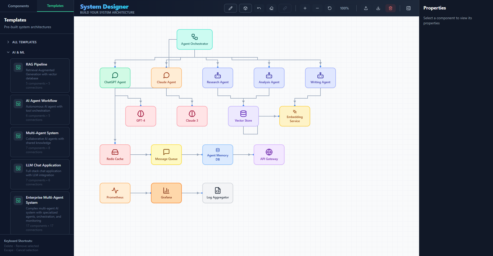

# System Designer

An interactive, browser-based canvas for sketching system architecture diagrams. Pick from 80+ components (from load balancers and databases to LLMs, vector stores, and Kubernetes), wire them together, or start from one of 23 ready-made architecture templates.



Everything runs client-side: no backend and no account. Your design auto-saves to the browser and can be exported to JSON.

## Features

- **80+ components in 15 categories**: AI & ML, MLOps, Data Science, Databases, DevOps, Security, Networking, Cloud, Infrastructure, Mobile, IoT, Blockchain, Testing, Monitoring, and Client. The component list is searchable.
- **23 architecture templates**: RAG pipeline, multi-agent systems, microservices, event-driven, load-balanced, MLOps training, big-data pipelines, Kubernetes, IoT, blockchain, monitoring stacks, and several larger "enterprise" variants.
- **Connections**: Shift-click to select several components, then press **Connect** to link the first one to the rest. Routes pick the nearest sides automatically.
- **Groups**: draw dashed boundaries around related components. Groups resize to fit the components inside them.
- **Freehand lines**: sketch annotations in Draw mode, with undo.
- **Zoom**: toolbar buttons, the mouse wheel, or the keyboard.
- **Properties panel**: rename, move, and resize the selected component.
- **Save and share**: auto-saves to `localStorage`; export and import designs as JSON.

## Getting started

Requires **Node.js 20.19+** (or 22.12+).

```bash
git clone https://github.com/djdelacruz2024/system-designer.git
cd system-designer
npm install
npm run dev
```

Then open http://localhost:5173.

On Windows you can also double-click `install.bat`, then `start.bat`.

### Production build

```bash
npm run build     # type-checks and outputs static files to dist/
npm run preview   # serves the build locally
```

`dist/` is a plain static site, so you can host it on GitHub Pages, Netlify, Vercel, or any static file server.

## Using the editor

| Action | How |
| --- | --- |
| Add a component | Click it in the sidebar, or drag it onto the canvas |
| Load a template | **Templates** tab, then click a template (replaces the current design) |
| Move a component | Drag it |
| Select several | Shift-click |
| Connect components | Select two or more, then click **Connect** |
| Delete a connection | Hover its midpoint and click **×** |
| Edit a component | Select it and use the **Properties** panel |
| Group components | Click **Group**, then drag a rectangle around them |
| Annotate | Click **Draw**, then drag to draw lines (**Undo** and **Clear Lines** available) |
| Save / load a file | **Export** / **Import** (JSON) |

On screens narrower than about 2000px the toolbar shows icons only; hover a button to see its name.

### Keyboard shortcuts

| Key | Action |
| --- | --- |
| `Delete` / `Backspace` | Delete the selected component(s) or group |
| `Esc` | Clear the selection and cancel connect or group mode |
| `+` / `-` | Zoom in / out |
| `0` | Reset zoom to 100% |

## Export format

Exports are plain JSON, so they're easy to version-control or generate:

```json
{
  "nodes": [
    { "id": "node-1", "type": "api", "label": "API Gateway", "x": 100, "y": 200, "width": 120, "height": 80 }
  ],
  "connections": [
    { "id": "conn-1", "fromNodeId": "node-1", "toNodeId": "node-2", "fromPosition": "right", "toPosition": "left" }
  ],
  "groups": [],
  "drawnLines": []
}
```

Files exported by older versions (without `groups` and `drawnLines`) still import fine.

## Tech stack

[React 18](https://react.dev) · [TypeScript](https://www.typescriptlang.org) · [Vite](https://vite.dev) · [Tailwind CSS](https://tailwindcss.com) · [Zustand](https://zustand.docs.pmnd.rs) (state) · [Lucide](https://lucide.dev) (icons)

## Project structure

```
src/
├── components/
│   ├── SystemDesigner.tsx     # Layout, auto-save, import/export
│   ├── Canvas.tsx             # Canvas: zoom, drag/drop, groups, drawing, shortcuts
│   ├── NodeComponent.tsx      # A single component box (icon + colors per type)
│   ├── Connection.tsx         # Routed connection lines
│   ├── Sidebar.tsx            # Component library and templates
│   ├── Toolbar.tsx            # Top toolbar
│   └── PropertiesPanel.tsx    # Edit the selected component
├── data/templates.ts          # The 23 architecture templates
└── store/useStore.ts          # Zustand store: nodes, connections, groups, modes
```

### Adding a component type

1. Add the type name to `NodeType` in `src/store/useStore.ts`.
2. Give it an icon and colors in `iconMap` and `colorMap` in `src/components/NodeComponent.tsx`.
3. List it in one or more categories in `src/components/Sidebar.tsx`.

## Roadmap

- [ ] Undo/redo for all edits (currently only freehand lines)
- [ ] Connection labels and selection
- [ ] Export to PNG/SVG
- [ ] Copy/paste and duplicate
- [ ] Snap-to-grid and auto-layout
- [ ] Light theme

## License

[MIT](LICENSE)
